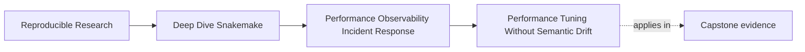
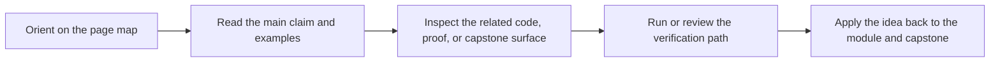

# Performance Tuning Without Semantic Drift

<!-- page-maps:start -->
## Page Maps

<!-- page-maps:end -->

The most dangerous performance improvement is the one that makes the workflow faster by
teaching it to hide its own meaning.

That happens more often than teams admit.

## The rule for honest tuning

A tuning change is honest only if reviewers can still answer the same semantic questions
about the workflow after the change:

- which files are declared inputs and outputs
- why reruns happen
- what counts as trusted published state
- which operating context differences are policy rather than workflow meaning

If the speedup depends on making one of those harder to see, the workflow did not become
better. It became easier to misread.

## Honest tuning moves

These can be valid when the evidence supports them:

- grouping genuinely tiny jobs whose outputs still preserve the same file contract
- reducing redundant helper work that does not change declared inputs or outputs
- adjusting threads, resources, or executor settings when the workflow meaning stays fixed
- moving heavy temporary traffic to a better storage surface when promotion boundaries stay clear
- simplifying an expensive summary or report step while keeping the public contract intact

The important phrase is "when the evidence supports them."

## Dishonest tuning moves

These should trigger strong review resistance:

- removing or weakening a dependency so Snakemake reruns less often
- using hidden side effects or undeclared caches to avoid declared work
- deleting logs, benchmarks, or provenance because they are inconvenient under pressure
- changing publish paths or sample-selection meaning and calling it optimization
- increasing retries or latency waits to hide a deterministic failure

Fast wrong workflows are still wrong workflows.

## Four questions before you approve a tuning change

1. Which cost class are we actually addressing?
2. Which evidence says this change targets that cost class?
3. Which workflow truth stays exactly the same after the edit?
4. Which artifact will prove that the change worked honestly?

If a proposal cannot answer all four, it is not ready.

## Example: grouping tiny jobs

Suppose a workflow launches one short QC job per sample, and executor overhead dominates.

Grouping work can be honest if:

- the grouped job still produces the same declared sample outputs
- the logs still let reviewers inspect failures with usable locality
- benchmarks still show the cost where it now lives
- rerun logic still follows the same inputs and outputs

Grouping becomes dishonest when it collapses output identity, hides which sample failed,
or turns one rule into a private wrapper around undeclared work.

## Example: tuning storage

Moving temporary files or scratch usage can be valuable.

It stays honest when:

- declared outputs remain on the trusted contract surface
- reviewers do not have to inspect scratch to know whether the run succeeded
- promotion into `publish/` or other stable outputs stays explicit

It becomes dishonest when temporary execution state quietly becomes the de facto interface.

## Example: simplifying evidence

Sometimes logs or reports really are too noisy.

Cleaning them up can be an improvement, but only if the revised evidence still answers the
review question it used to answer. "Shorter" is not automatically "clearer."

Ask:

- which question did the old evidence answer poorly?
- which question will the new evidence answer better?
- what important diagnostic detail might be lost?

## A useful review frame

Use this table in review when an optimization looks attractive:

| Review question | Strong answer |
| --- | --- |
| what got faster | names the cost class and the affected rule family or boundary |
| why it got faster | points to a concrete structural or operational reason |
| what stayed the same | names the unchanged workflow contract |
| how we know it stayed the same | points to a dry-run, summary, benchmark, verification, or publish artifact |

This slows the conversation down in a good way.

## A small before-and-after note

Weak note:

> Reduced runtime by changing rule behavior and simplifying execution.

Strong note:

> Reduced scheduler overhead by grouping 400 sub-second cleanup jobs into one reviewed
> aggregation rule. The declared published outputs are unchanged, the per-sample result
> files remain separate, and the new benchmark surface moved from the leaf jobs to the
> aggregator rule. Dry-run and publish verification still match the previous contract.

One of these is reviewable. The other is not.

## When tuning should stop and become design review

Escalate from tuning to design review when the proposal changes:

- target selection
- file contracts
- publish paths
- sample discovery rules
- the boundary between workflow meaning and profile policy

Those are not merely performance details. They are workflow meaning.

## Keep this standard

Do not merge a performance change until the review records both sides:

- the speed claim
- the semantic non-change claim

If only the first claim is written down, the second claim will be assumed, and that is how
drift gets normalized.
