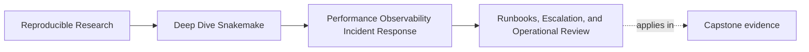
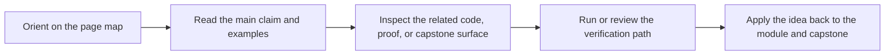
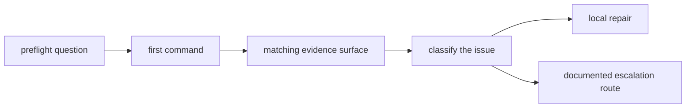

# Runbooks, Escalation, and Operational Review


<!-- page-maps:start -->
## Page Maps




<!-- page-maps:end -->

A workflow becomes easier to maintain when incident handling stops depending on memory.

That is what a runbook is for.

A good runbook does not try to explain the whole repository. It gives the next maintainer
the shortest reliable route through a stressful question.

## What a Module 09 runbook should answer

At minimum, the runbook should tell a maintainer:

- how to confirm the symptom without mutating the repository
- which command gives the narrowest honest answer first
- where the matching logs, benchmarks, and summaries live
- how to decide whether the issue is semantic, operational, or publish-related
- when to escalate instead of tuning locally

If any of those are missing, the team will fill the gap with folklore.

## A simple runbook shape



That shape is enough for most teams.

## The five sections worth keeping

### 1. Symptom check

Name the smallest command that confirms the problem:

- `snakemake -n -p`
- `snakemake --summary`
- `make -C capstone wf-dryrun`

This section should prevent unnecessary real runs.

### 2. Evidence route

Say where to look next:

- rule-local logs for one failing or slow target
- benchmark files for the suspicious rule family
- provenance or profile evidence when context differs
- published verification evidence when trust in outputs is the real question

### 3. Decision boundary

The runbook should help a maintainer decide whether the issue belongs to:

- workflow semantics
- operating context or profile policy
- storage and staging behavior
- tool implementation
- publish-boundary verification

This is the difference between a calm repair and an aimless investigation.

### 4. Escalation triggers

Escalate when:

- the proposed fix changes workflow meaning
- the issue appears only in one operating context and profile review is required
- the published contract may no longer be trustworthy
- the same incident keeps returning and should become an executable check

### 5. Proof route

End the runbook with the commands that prove the repair honestly:

```bash
make -C capstone evidence-summary
make -C capstone tour
make -C capstone verify-report
make -C capstone profile-audit
```

These commands are not always all required. They are the module's reliable escalation
surfaces.

## Turning recurring incidents into reviewable operations

One of the best runbook improvements is converting a repeated manual check into a stable
artifact or command.

Examples:

- a repeated "which profiles differ?" question becomes `make profile-audit`
- a repeated "what evidence exists from the last real run?" question becomes
  `make evidence-summary`
- a repeated "can I review the whole execution route in one place?" question becomes
  `make tour`

This is how operations become calmer without becoming opaque.

## What escalation should look like

Escalation is not failure. It is boundary recognition.

Escalation is healthy when a note says:

> The evidence points away from rule-local runtime and toward profile or publish drift, so
> I am moving this from local tuning into profile review and verification.

That sentence protects the workflow from the wrong kind of "quick fix."

## A short runbook example

Here is a minimal pattern:

1. Confirm with `snakemake -n -p` or `make -C capstone wf-dryrun`.
2. Use `snakemake --summary` to check whether the workflow state matches the report.
3. Inspect the matching rule log and benchmark only for the affected target family.
4. If context differs, inspect provenance or run `make -C capstone profile-audit`.
5. If published trust is in question, run `make -C capstone verify-report`.
6. Record the incident class before proposing a repair.

That is short enough to use and strong enough to guide review.

## Common runbook mistakes

- listing every command in the repository instead of the first honest one
- mixing semantic repair steps with profile-only operating advice
- treating scratch or temporary outputs as if they were trusted contract surfaces
- ending with "investigate further" instead of a real escalation route

The runbook exists to remove ambiguity, not to preserve it.

## Keep this standard

By the end of this module, a teammate should be able to answer:

- what do I run first?
- what do I inspect second?
- when do I stop patching and escalate?

If the runbook does not answer those three questions, it is still notes, not operations.
