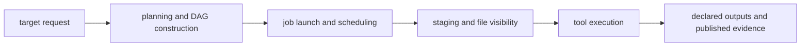

# Workflow Cost Models and Timing Surfaces

When a team says "the workflow is slow," they usually mean at least four different things.

That vagueness is the first problem to fix.

Snakemake spends time in layers, and those layers do not point to the same repair:

- workflow planning and discovery
- scheduler and job-launch overhead
- filesystem or staging latency
- real tool runtime

If you merge them into one complaint, every later decision gets worse.

## The four cost classes

| Cost class | What it means | Typical symptoms | Best first evidence |
| --- | --- | --- | --- |
| planning cost | time spent reading config, expanding targets, resolving wildcards, and building the DAG | dry-run feels slow before any job starts | `snakemake -n -p`, target count, discovery artifacts |
| scheduler cost | time spent launching, tracking, and finishing many jobs | thousands of short jobs make the run feel busy but not productive | job count, per-rule runtime, executor logs |
| storage drag | time lost to staging, filesystem latency, or slow visibility of outputs | jobs finish but downstream rules wait, rerun, or see files late | rule logs, storage-specific timings, profile settings |
| tool runtime | time spent inside scripts or external tools | one or two rules dominate elapsed time | `benchmark:` files, tool logs, resource usage |

The job is not to memorize these names. The job is to stop reaching for the wrong fix.

## A practical mental model

This is not a strict clock trace. It is a teaching model.

A slow run can touch more than one layer, but you should still ask which layer dominates.

## How to ask the first honest question

Start with these questions in order:

1. Is the workflow planning more work than expected?
2. Are there too many tiny jobs for the chosen executor and storage context?
3. Are jobs waiting on files rather than on computation?
4. Is one rule or tool genuinely expensive?

That order matters because it keeps you from blaming a tool for a workflow-shape problem or
blaming Snakemake for a storage problem.

## A small example

Imagine a workflow with 800 samples and three light preprocessing rules per sample.

Each rule takes about one second of real tool time.

If the executor needs roughly the same amount of time to launch and finalize each job, the
run may feel slow even though no single tool is expensive. That is a scheduler-shape
problem, not a "buy a faster aligner" problem.

Now change the story:

- dry-run is already slow
- the discovered sample list doubled after a helper edit
- benchmarks for the tools look normal

That is not primarily scheduler cost. It is a planning and discovery problem.

The right fix is to repair discovery or target expansion, not to tune threads.

## Timing surfaces you can trust

Use more than one surface, but keep each surface narrow.

| Surface | What it helps you decide |
| --- | --- |
| `snakemake -n -p` | whether the planned work matches your mental model |
| `snakemake --summary` | which outputs exist, are pending, or were rebuilt |
| `benchmark:` files | which rules actually consume time once launched |
| per-rule logs | whether time was spent computing, waiting, or failing |
| `make -C capstone evidence-summary` | whether logs, benchmarks, provenance, and published paths still agree |

No single artifact explains the whole run. That is normal.

## Common misreadings

### Mistaking planner cost for tool cost

If dry-run is already surprisingly slow, launching the real run earlier will not explain
the problem. It only adds more moving parts.

### Mistaking scheduler cost for parallel speedup opportunity

Many tiny jobs do not automatically justify more cores. In some contexts, more concurrency
makes the scheduler and filesystem work harder while the tools stay tiny.

### Mistaking storage drag for nondeterminism

Late file visibility, staging delays, or slow shared storage can look random. Before you
call a run flaky, ask whether files are arriving where the workflow expects them on the
timeline the executor and storage actually provide.

### Mistaking one noisy log for the whole cost story

A loud log is not the same thing as an expensive rule. Volume and runtime are different
signals.

## What a good first note looks like

Before proposing a fix, write a note no longer than five lines:

1. which cost class looks dominant
2. which artifact suggests that
3. what you have ruled out already
4. what narrower measurement you will collect next

Example:

> The current slowdown looks scheduler-dominated rather than tool-dominated. Dry-run plans
> 2,400 short jobs, while existing benchmark files still show sub-second rule runtimes.
> I have not seen evidence of slower tool behavior yet. Next I want the per-rule job count
> and one representative benchmark from the busiest rule family.

That note is already more useful than "workflow feels slow."

## Keep this standard

Do not approve performance work until the review names the cost class first.

If the diagnosis starts with threads, retries, grouping, or profile edits before the cost
class is named, the workflow is already at risk of being tuned blindly.
