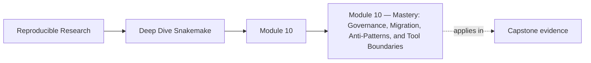
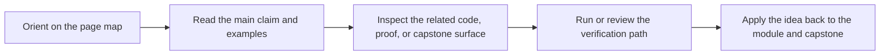

<a id="top"></a>

# Module 10 — Mastery: Governance, Migration, Anti-Patterns, and Tool Boundaries


<!-- page-maps:start -->
## Page Maps




<!-- page-maps:end -->

The final step in learning Snakemake is not another directive or another executor flag.
It is judgment. Mature workflow engineering means reviewing an existing repository without
wishful thinking, deciding what must remain stable, changing the right boundary first, and
knowing when Snakemake should stay the orchestrator versus when a different system should
own a concern.

This module is about that kind of judgment: how to govern a long-lived workflow, migrate
it safely, reject recurring anti-patterns early, and explain the workflow’s boundaries in
a way another team can trust.

### Before You Begin

This module works best after the rest of the program. It assumes you already understand
file contracts, dynamic DAGs, operations, publish boundaries, and architecture review.

Use this module if you need to learn how to:

* review a real workflow for risk instead of only style
* plan a migration without breaking trusted outputs or verification habits
* decide whether Snakemake should keep owning a workflow concern

Proof loop for this module:

```bash
snakemake -n
snakemake --summary
snakemake --list-changes input code params
```

Capstone corroboration:

* inspect `capstone/Snakefile`
* inspect `capstone/FILE_API.md`
* inspect `capstone/profiles/`
* inspect `capstone/tests/` and `capstone/Makefile`

## At a Glance

| Focus | Learner question | Capstone timing |
| --- | --- | --- |
| evidence-first review | "What should I inspect before I suggest a redesign?" | use the capstone only after you can describe its current contract honestly |
| boundary-safe migration | "Which single boundary can move without making the rest of the workflow vague?" | compare file API, profiles, and tests together before proposing change |
| governance | "Which review rules keep this workflow healthy two years from now?" | use the capstone as a small governance example, not only a build demo |

---

<a id="toc"></a>
## 1) Table of Contents

1. [Table of Contents](#toc)
2. [Learning Outcomes](#outcomes)
3. [How to Use This Module](#usage)
4. [Core 1 — Reviewing a Workflow Without Wishful Thinking](#core1)
5. [Core 2 — Safe Migration Plans and Boundary Moves](#core2)
6. [Core 3 — Governance for Long-Lived Workflow Repositories](#core3)
7. [Core 4 — Recurring Snakemake Anti-Patterns](#core4)
8. [Core 5 — Deciding When Snakemake Should Stop Owning a Concern](#core5)
9. [Capstone Sidebar](#capstone)
10. [Exercises](#exercises)
11. [Closing Criteria](#closing)

---

<a id="outcomes"></a>
## 2) Learning Outcomes

By the end of this module, you can:

* review a real Snakemake repository for contract, operational, and publish risks
* plan a migration that preserves trusted outputs and proof surfaces
* define lightweight governance rules for future workflow changes
* identify anti-patterns before they become normalized repository behavior
* explain when Snakemake remains the right orchestrator and when another tool should own part of the system

[Back to top](#top)

---

<a id="usage"></a>
## 3) How to Use This Module

Pick one real Snakemake repository and write a short review with five sections:

1. file-contract risks
2. dynamic or operational risks
3. publish-boundary risks
4. migration opportunities
5. tool-boundary recommendation

Do not start by rewriting. Start by making the current state legible enough that change
can be deliberate.

[Back to top](#top)

---

<a id="core1"></a>
## 4) Core 1 — Reviewing a Workflow Without Wishful Thinking

A real workflow review should answer:

* what are the stable published outputs?
* which rules or helpers are hardest to reason about?
* where are operating assumptions encoded?
* which parts are trustworthy because they are tested, and which are only trusted socially?
* what would break if a new maintainer changed one directory or profile?

Good review starts with evidence:

* dry-runs
* summaries and drift reports
* file API documents
* tests and proof targets

Style matters later. Truth comes first.

[Back to top](#top)

---

<a id="core2"></a>
## 5) Core 2 — Safe Migration Plans and Boundary Moves

Migration is safest when you move one boundary at a time:

* publish contract
* helper code boundary
* profile boundary
* module or repository structure
* execution backend or storage model

Migration questions:

* which existing outputs must remain stable?
* which review artifacts prove the migration did not damage trust?
* what is the smallest reversible step?
* who will be affected by a contract change?

If you cannot say which boundary is being moved, the migration plan is still too vague.

[Back to top](#top)

---

<a id="core3"></a>
## 6) Core 3 — Governance for Long-Lived Workflow Repositories

Good governance does not mean bureaucracy. It means a few durable rules such as:

* every new published file must have a contract story
* every new helper boundary must keep inputs explicit
* every operational profile change must be reviewable as policy, not hidden semantics
* every significant workflow change should keep a proof surface intact

Long-lived workflows degrade when:

* nobody owns the public contract
* local convenience is allowed to outrank reproducibility
* profile or config drift is never reviewed as part of workflow change

[Back to top](#top)

---

<a id="core4"></a>
## 7) Core 4 — Recurring Snakemake Anti-Patterns

Anti-patterns worth rejecting early:

* hidden inputs read from helper code or shell state
* profiles used to smuggle semantic changes
* published consumers reading from `results/` instead of the file API
* checkpoints used to hide unstable discovery instead of recording it
* helpers or wrappers that mutate outputs not declared in the rule
* operational tuning that suppresses evidence instead of solving the issue

Mastery is often the discipline to say “no” before convenience becomes architecture.

[Back to top](#top)

---

<a id="core5"></a>
## 8) Core 5 — Deciding When Snakemake Should Stop Owning a Concern

Snakemake remains a strong fit when:

* file-based workflow contracts are still the right abstraction
* dynamic discovery remains explainable and recordable
* publishing and verification can stay local to the repository
* the main problem is orchestrating reproducible computation across explicit artifacts

Another system may need to own part of the stack when:

* execution becomes fundamentally service-driven or event-driven
* scheduling policy dominates the design more than file contracts do
* provenance requirements exceed what the repository can review sanely
* downstream product interfaces need a platform contract larger than the workflow itself

The mature answer is often hybrid: keep Snakemake for the parts it explains well, and
hand another concern to a system built for that responsibility.

[Back to top](#top)

---

<a id="capstone"></a>
## 9) Capstone Sidebar

Use the capstone as a review specimen:

* `Snakefile` and `workflow/rules/` for workflow truth
* `FILE_API.md` for public contract review
* `profiles/` for policy review
* `Makefile`, tests, and verification targets for governance and migration proof surfaces

[Back to top](#top)

---

<a id="exercises"></a>
## 10) Exercises

1. Review one real Snakemake repository and list its top five risks in contract language, not only style language.
2. Write a migration plan that preserves the publish contract while changing one internal boundary.
3. Draft a short governance note for how your team should review profile, publish, and helper-code changes.
4. Pick one workflow concern and argue clearly whether Snakemake should continue to own it.

[Back to top](#top)

---

<a id="closing"></a>
## 11) Closing Criteria

You pass this module only if you can demonstrate:

* an evidence-based review of a real workflow
* a migration plan that preserves trust while changing one boundary
* explicit governance rules for future workflow changes
* a clear recommendation for where Snakemake remains the right tool and where it should stop

[Back to top](#top)
