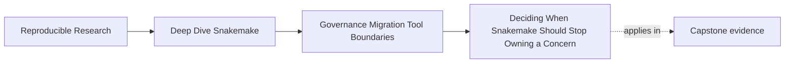
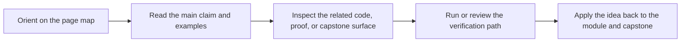
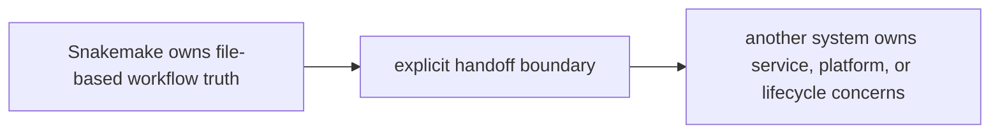

# Deciding When Snakemake Should Stop Owning a Concern

<!-- page-maps:start -->
## Page Maps

<!-- page-maps:end -->

One of the most mature things a workflow team can say is:

> Snakemake is still the right owner here.

Another mature answer is:

> Snakemake should stop owning this part of the system.

Module 10 is about knowing the difference.

## Start with ownership, not novelty

Tool-boundary decisions go bad when the argument sounds like this:

- another platform is more modern
- we should standardize on one stack
- this repository feels too custom

Those may be real pressures, but they do not answer the main question:

> which system can own this concern while keeping its contract, evidence, and operating
> model reviewable?

That is the only question that matters here.

## When Snakemake is still a strong owner

Snakemake remains a good fit when:

- the workflow is still best explained as file-based orchestration
- target selection and discovery remain inspectable
- published outputs and provenance can stay repository-local and reviewable
- the main challenge is coordinating reproducible computation, not managing a long-lived service
- operating contexts differ, but the semantic workflow plan stays stable

In those cases, migrating away can easily create more indirection than value.

## When another system may need to own the concern

A different system may deserve ownership when:

- the problem is fundamentally service-driven or event-driven rather than file-driven
- deployment, authentication, or platform lifecycle dominates the design
- state now lives mainly outside the repository
- queueing, tenancy, or product-platform policy matters more than DAG review
- the workflow is becoming one component inside a larger system with stronger interface needs

This does not automatically mean "remove Snakemake." It means the ownership line needs a
fresh look.

## Hybrid ownership is often the honest answer

Hybrid boundaries are not a compromise to apologize for. They are often the most accurate
representation of reality.

Examples:

- Snakemake owns data preparation and publish artifacts, while a platform owns deployment
- Snakemake owns scientific orchestration, while a service owns user-triggered requests
- Snakemake owns reproducible batch outputs, while a scheduler platform owns multi-tenant policy

The important word is explicit.

## A practical decision table

| Question | If "yes", lean toward |
| --- | --- |
| are explicit files still the clearest contract surface | keep ownership in Snakemake |
| is the repository still the best place to review provenance and publish trust | keep ownership in Snakemake |
| does the concern depend on service state, APIs, or event streams more than files | move ownership outward |
| is the main pressure operational platform policy rather than workflow truth | move ownership outward or split ownership |
| can you describe a clean handoff artifact between systems | hybrid migration may be ready |

This table is not a scoring system. It is a way to keep the discussion concrete.

## A small example

Suppose a team has a healthy Snakemake repository for batch analysis, and now wants a web
application where users submit analyses on demand.

Weak tool-boundary answer:

> rewrite everything on the platform so it is all in one place.

Stronger answer:

- keep Snakemake as the owner of reproducible batch execution and publish artifacts
- let the web platform own requests, user identity, scheduling policy, and delivery
- define the handoff through explicit inputs, job submission metadata, and published outputs

That answer respects both systems.

## Warning signs that ownership is drifting

Watch for these signals:

- repository review tells you less about the real runtime state than the external platform dashboard
- profile files become a proxy for infrastructure that the repository cannot explain honestly
- publish trust depends more on external service state than on repository verification
- the workflow starts pretending to be a service framework

These do not force migration immediately, but they do mean the current ownership story is
weakening.

## What a good recommendation sounds like

A strong Module 10 recommendation usually has three parts:

1. what Snakemake should keep owning
2. what another system should own
3. what evidence or interface makes the handoff reviewable

Example:

> Snakemake should keep owning sample discovery, rule orchestration, and the versioned
> publish bundle because those remain file-based and reviewable in the repository. The
> deployment platform should own user-triggered job requests, access control, and cluster
> scheduling policy. The handoff should be documented through explicit job-input metadata,
> profile review, and published output verification.

That is a better recommendation than "move to platform X."

## Keep this standard

Do not approve a tool-boundary argument that only names the destination tool.

Require it to name:

- the concern being moved
- the ownership reason
- the handoff artifact or proof route

Without those, the recommendation is still technology preference, not stewardship.
