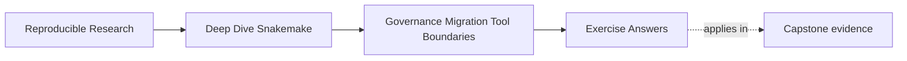
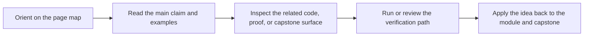

# Exercise Answers

<!-- page-maps:start -->
## Page Maps

<!-- page-maps:end -->

These answers are model explanations, not the only acceptable wording.

What matters is whether the reasoning protects trust while change is being planned.

## Answer 1: Review the current repository honestly

Strong top risks:

- contract drift, because downstream notebooks still read `results/`
- policy leakage, because one profile changes sample filtering
- invisible complexity, because discovery logic lives in helper code reviewers cannot
  explain quickly

Which risk to address first:

- contract drift

Why:

- hidden downstream dependence on internal results makes every later migration more risky

Evidence route to inspect first:

- the file API and publish verification route, such as `make verify-report`

The main lesson is to review the current trust boundary before touching implementation.

## Answer 2: Sequence a migration

A safer order would be:

1. change report generation ownership first, while keeping the same published outputs
2. compare proof routes and outputs to make sure the migration is behavior-preserving
3. review and then change sample discovery with explicit dry-run comparison
4. leave platform submission until the workflow contract and proof route are stable

What proof must survive:

- publish verification
- dry-run meaning
- any comparison route between old and new output surfaces

Which change should wait:

- platform migration

Why:

- it changes the ownership boundary most broadly and should not be mixed with unresolved
  workflow-truth changes

## Answer 3: Write governance rules

A strong set of rules could be:

1. every new published file must update the file API and verification route
2. profiles may change operating policy but not workflow meaning
3. helper boundaries must stay reviewable, with ownership and proof surfaces kept visible

Why these work:

- they are short enough to enforce
- they each protect a recurring source of drift

## Answer 4: Name the anti-pattern

Anti-pattern families:

- removing benchmark files: evidence suppression
- adding a new published TSV without verification updates: contract drift
- moving analytical thresholds into `profiles/slurm/config.yaml`: policy leaks

Most dangerous change:

- moving analytical thresholds into the profile

Why:

- it quietly changes workflow meaning through an operating surface, which makes context
  comparison and future review much less trustworthy

Recovery step to require first:

- move the semantic setting back into visible workflow or config boundaries, then audit the
  profile again

## Answer 5: Decide the tool boundary

A strong recommendation would say:

- Snakemake should keep owning reproducible workflow orchestration and trusted publish bundles
- another system should own user-triggered requests, access control, and tenancy-aware scheduling
- the split should be made reviewable through explicit submission metadata, profile review,
  and published output verification

Why this is strong:

- it keeps file-based workflow truth where it is already visible
- it hands platform-native concerns to the system built to own them
- it names the handoff evidence rather than only naming the destination tool

## Self-check

If your answers consistently explain:

- what the current repository is already promising
- what proof must survive the next change
- which governance rule blocks recurring drift
- what ownership line makes the system easier to trust

then you are using Module 10 correctly.
