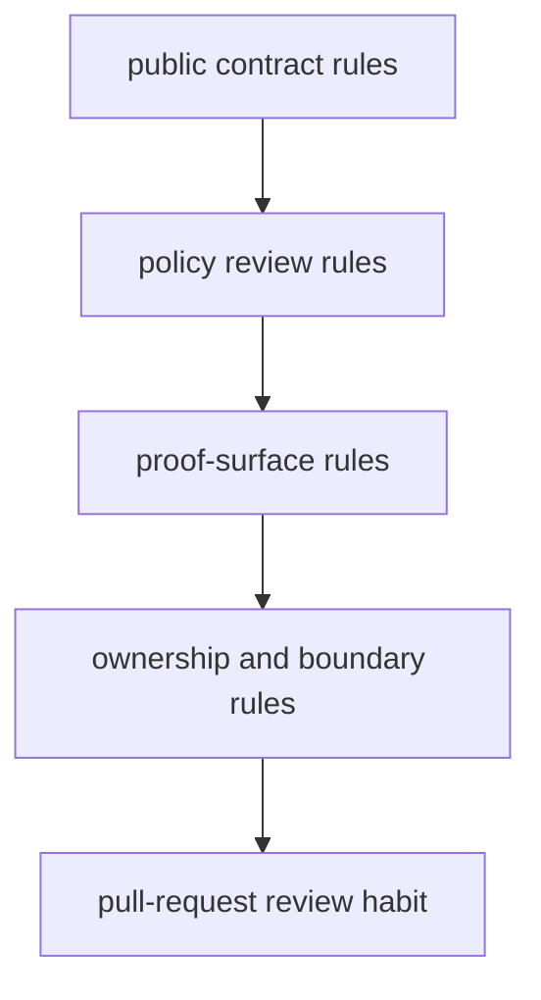

# Governance Rules for Long-Lived Workflows

Good governance is not bureaucracy layered on top of a workflow.

Good governance is the small set of review rules that stop a repository from drifting into
private knowledge and accidental contracts.

## What governance should protect

In a long-lived Snakemake repository, governance should protect at least four things:

- the public file contract
- the boundary between workflow meaning and operating policy
- the proof route maintainers use under pressure
- ownership clarity around helper code, modules, and downstream interfaces

If governance does not protect those, it usually protects the wrong things.

## A simple governance model

This is enough for most workflow teams. Governance only becomes heavy when the repository
itself is already unclear.

## Rule 1: Every public file needs a contract story

If a new file appears under a published boundary, review should ask:

- who is meant to trust this file
- whether it is stable enough for downstream use
- where its meaning is documented
- whether verification and manifests know it exists

This keeps "we happened to publish it" from turning into "we now support it forever."

## Rule 2: Profiles may change policy, not workflow meaning

Profile review should treat these as ordinary:

- core count
- executor selection
- queue or resource policy
- latency and retry settings, when justified

Profile review should treat these as escalation triggers:

- sample selection
- publish path meaning
- analytical thresholds that change results
- anything that alters the planned workflow semantics

This one rule prevents a lot of quiet drift.

## Rule 3: Proof surfaces must survive change

Every significant workflow change should preserve or improve at least one visible proof
route:

- dry-run meaning
- rerun-cause visibility
- publish verification
- profile comparison
- execution evidence

If a change removes one of these with the promise to restore it later, governance should
push back.

## Rule 4: Ownership boundaries should stay visible

A repository becomes fragile when nobody can answer which layer owns:

- orchestration
- step-local implementation
- reusable package code
- public path contracts
- operating policy

Governance should force that question into review whenever a helper boundary or module
boundary moves.

## Rule 5: Downstream trust should be reviewed explicitly

Teams often notice downstream consumers only after a migration breaks them.

Good governance asks earlier:

- which published files are machine-facing
- which are human-facing
- whether any downstream consumer still depends on internal results
- whether a path change is compatible, repair-only, or version-worthy

This is why publish review belongs inside governance, not only release engineering.

## A small example

Suppose a pull request:

- changes `profiles/slurm/config.yaml`
- adds a field to `publish/v1/summary.json`
- moves one helper from `workflow/scripts/` into `src/`

A weak governance process might review that as one generic refactor.

A stronger process applies three separate rules:

- profile review checks policy versus semantics
- publish review checks downstream compatibility
- ownership review checks whether the new package boundary is clearer or more hidden

That is the difference between generic code review and workflow governance.

## Keep governance lightweight but sharp

A good governance checklist can be short:

1. did the public contract change
2. did workflow meaning move into policy
3. did we preserve proof routes
4. did ownership get clearer or blurrier
5. did downstream trust get weaker

Short is good. Vague is not.

## Governance failure patterns

Watch for these signals:

- every review becomes style discussion because boundary questions are never asked
- profiles accumulate semantic settings because they are convenient to change
- publish paths grow, but nobody owns compatibility review
- helper code expands, but no one records what moved out of visible workflow logic
- important commands still exist, but nobody can say which are canonical under pressure

These are governance problems even when the repository still "works."

## Keep this standard

By the end of Module 10, a team should be able to say:

- which workflow changes always need contract review
- which profile changes need semantic skepticism
- which proof routes are non-negotiable
- which ownership boundaries must stay explicit

If that cannot be said plainly, governance is still implicit, and implicit governance is
where long-lived drift starts.
