# Module 10: Governance, Migration, and Tool Boundaries

Module 10 is where the course stops asking, "Can you build a working workflow?" and starts
asking, "Can you inherit one responsibly?"

That is a different skill.

A mature Snakemake maintainer needs to review the repository they already have, separate
style complaints from real trust problems, plan change without losing proof, and say
plainly when Snakemake should remain the owner of a concern and when it should not.

This module is about stewardship:

- reading a workflow as a long-lived product rather than a pile of rules
- improving one boundary at a time without losing review evidence
- defining governance rules future maintainers can actually follow
- spotting recurring anti-patterns before they become culture
- drawing honest tool boundaries instead of fashionable ones

The capstone corroboration surface for this module is the repository review route around
its public and operational boundaries: `docs/FILE_API.md`, `make walkthrough`,
`make verify-report`, `make profile-audit`, `docs/PUBLISH_REVIEW_GUIDE.md`, and
`docs/PROFILE_AUDIT_GUIDE.md`.

## Why this module exists

Workflow repositories age badly when teams normalize these habits:

- redesign is proposed before the current contract is described
- migration plans use words like "modernize" but do not preserve comparison evidence
- profile, publish, and helper changes are reviewed only as implementation details
- public trust depends on social memory instead of a visible review route
- Snakemake keeps owning concerns it no longer explains well

This module repairs those problems by treating governance and migration as part of
reproducibility, not as management overhead.

## Study route

```mermaid
flowchart LR
  overview["Overview"] --> core1["Core 1: review current truth"]
  core1 --> core2["Core 2: migrate without losing proof"]
  core2 --> core3["Core 3: governance rules"]
  core3 --> core4["Core 4: recurring anti-patterns"]
  core4 --> core5["Core 5: tool-boundary decisions"]
  core5 --> example["Worked example"]
  example --> practice["Exercises and answers"]
  practice --> glossary["Glossary"]
```



Read the module in that order the first time.

If the problem is already clear, use this shortcut:

- open Core 1 when the question is "what is this repository actually promising today?"
- open Core 2 when the question is "how do we change it without losing trust?"
- open Core 3 when the question is "what review rules should the team enforce?"
- open Core 4 when the question is "which habits are making this workflow harder to trust?"
- open Core 5 when the question is "should Snakemake still own this concern?"

## Module map

| Page | Purpose |
| --- | --- |
| `index.md` | explains the module promise and study route |
| `reviewing-workflow-contracts-and-current-truth.md` | teaches how to review the repository you have before proposing redesign |
| `migration-plans-that-preserve-proof.md` | teaches how to move one boundary at a time without losing review evidence |
| `governance-rules-for-long-lived-workflows.md` | teaches lightweight rules that keep the repository trustworthy over time |
| `recurring-workflow-antipatterns-and-recovery.md` | teaches which patterns deserve early rejection and how to recover from them |
| `deciding-when-snakemake-should-stop-owning-a-concern.md` | teaches how to draw honest handoff boundaries |
| `worked-example-planning-a-safe-workflow-migration.md` | walks through one realistic migration plan from review to sequence |
| `exercises.md` | gives five mastery exercises |
| `exercise-answers.md` | explains model answers and review logic |
| `glossary.md` | keeps the module vocabulary stable |

## What should be clear by the end

By the end of this module, you should be able to explain:

- how to review a Snakemake repository in contract language instead of taste language
- how to plan a migration that preserves trusted outputs and proof routes
- which governance rules protect repository health over time
- which recurring workflow habits should be rejected before they become normalized
- when Snakemake remains the right owner and when another system should take over part of the work

## Commands to keep close

These commands form the review loop for Module 10:

```bash
snakemake -n -p
snakemake --summary
snakemake --list-changes input code params
make -C capstone walkthrough
make -C capstone verify-report
make -C capstone profile-audit
```

The point of that route is stable evidence: workflow plan, current state, rerun cause,
publish trust, and operating-context review.

## Capstone route

Use the capstone only after the local module ideas are already legible.

Best corroboration surfaces for this module:

- `capstone/Snakefile`
- `capstone/docs/FILE_API.md`
- `capstone/docs/PUBLISH_REVIEW_GUIDE.md`
- `capstone/docs/PROFILE_AUDIT_GUIDE.md`
- `capstone/docs/REVIEW_ROUTE_GUIDE.md`
- `capstone/Makefile`

Useful proof route:

```bash
make -C capstone walkthrough
make -C capstone verify-report
make -C capstone profile-audit
make -C capstone confirm
```

The point of that route is not to admire the capstone. It is to practice how governance,
migration, and tool-boundary questions stay grounded in visible evidence.
