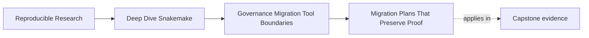
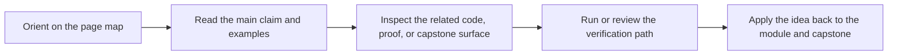
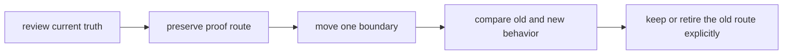

# Migration Plans That Preserve Proof

<!-- page-maps:start -->
## Page Maps

<!-- page-maps:end -->

Migration becomes dangerous the moment a team starts treating "change" as the goal and
"proof" as cleanup for later.

That is backwards.

A safe migration plan changes one boundary at a time while keeping enough evidence alive to
answer a simple question:

> what still works, what changed on purpose, and how do we know?

## The migration mistake that burns months

Teams often discover real pain in an inherited workflow and jump to this conclusion:

> the safe path is to replace everything in one cleaner design.

That is almost never the safe path.

A large rewrite can reduce visible mess while destroying your ability to compare:

- old and new publish bundles
- old and new dry-run meaning
- old and new profile behavior
- old and new proof routes

If comparison disappears, regressions get explained away instead of diagnosed.

## Preserve the questions before changing the answers

Before moving a boundary, identify the questions the current repository can still answer:

- which files are public
- which inputs and parameters cause reruns
- which profiles change policy only
- which proof commands a reviewer already trusts

The migration plan should preserve those questions even if the implementation moves.

## A good migration sequence

That sequence is plain on purpose. Most unsafe migrations fail by skipping one of those
steps.

## Move one boundary at a time

In Snakemake repositories, the boundaries that often move are:

- publish contract
- sample discovery and DAG shape
- helper-code ownership
- profile and operating-context policy
- workflow module or repository layout
- external system handoff

If a single change tries to move three of these at once, review gets vague very quickly.

## Start by strengthening proof, not by deleting the old path

Suppose a team wants to redesign sample discovery and publish reporting.

A weak migration plan says:

- rewrite discovery
- rewrite report generation
- update downstream notebook paths
- remove the old verification route

A better plan says:

1. keep `make verify-report` working
2. keep the current file API visible
3. add a clearer discovered-sample artifact if needed
4. change discovery while comparing dry-run and publish results
5. only then adjust reporting or downstream interfaces

That order keeps the public truth alive while the internals move.

## Comparison routes should be boring and specific

Migration gets safer when you add temporary comparison artifacts or commands.

Examples:

- compare old and new `summary.json` outputs
- compare dry-run target lists before and after a discovery change
- compare profile-audit bundles before and after an infrastructure move

These routes are not glamorous, but they stop migration review from becoming a debate
about confidence and aesthetics.

## A small example

Imagine a repository where:

- downstream readers trust `publish/v1/summary.json`
- maintainers want to move report generation into a Python package
- the current report rule is hard to test

The safe plan is not "rewrite reporting."

The safe plan is:

1. write down which publish files must remain stable
2. keep `verify-report` intact
3. move report logic behind the same declared file contract
4. compare old and new report artifacts
5. retire the old helper only after comparison stays boring

That is what it means to preserve proof.

## Hybrid stages are usually honest

For a while, a migration may leave the repository in a mixed state:

- Snakemake still owns orchestration
- a package now owns one complex implementation surface
- an external platform owns deployment or scheduling policy

This is often healthier than pretending one change should settle everything.

Hybrid stages are fine when the handoff is visible and the proof route still tells a clear
story.

## The three questions every migration step must answer

Before approving one step, write down:

1. what exact boundary is moving
2. what evidence proves trust is preserved
3. what route remains available until the new route earns trust

If the third answer is vague, the step is probably too large.

## A useful migration table

| Part | What to record |
| --- | --- |
| current contract | which files, rules, or review routes must stay trusted |
| defect class | what is actually wrong: contract ambiguity, policy drift, hidden ownership, weak proof, or wrong tool boundary |
| intended move | which single boundary changes next |
| preserved proof | which command or artifact still lets you compare old and new |
| retirement condition | what must be true before the old route disappears |

This keeps migration plans from becoming wish lists full of vague verbs.

## Keep this standard

Do not approve migration language like "modernize," "clean up," or "move to a better
system" unless the proposal also names:

- the boundary being moved
- the proof being preserved
- the comparison route

If those are absent, the plan is still a mood, not a migration.
