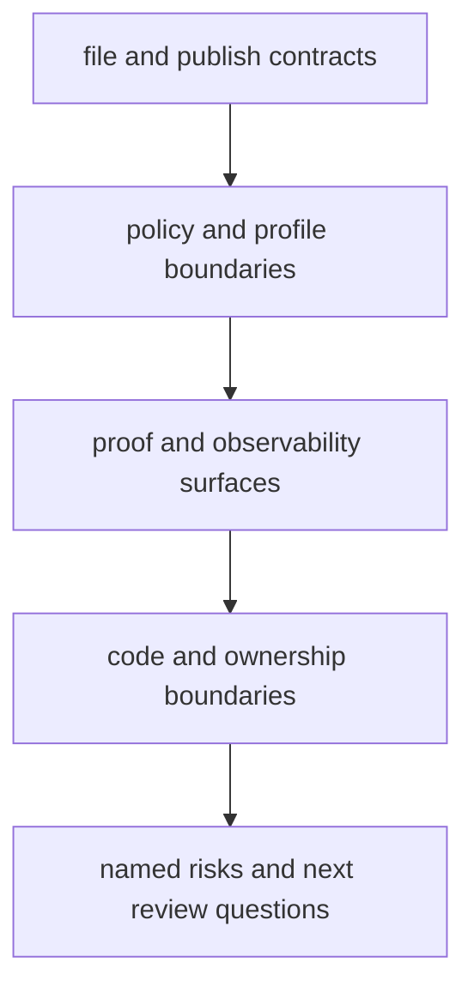

# Reviewing Workflow Contracts and Current Truth

The fastest way to waste time in a mature repository is to propose a redesign before you
can describe what the current system is promising.

That is why Module 10 starts with review.

Review here does not mean style cleanup. It means naming the boundaries another maintainer
would need to trust before changing anything.

## What a real review should settle

Before you recommend migration, refactoring, or replacement, a workflow review should
answer five questions:

1. what files or reports are actually public and trusted
2. which internal surfaces are useful but not contract surfaces
3. where policy lives and how it differs from workflow meaning
4. which evidence surfaces still let you explain behavior under pressure
5. which parts of the repository are socially trusted but not yet technically reviewable

If those are still fuzzy, the repository is not ready for big change.

## A useful review frame

This is not paperwork. It is the shortest route to an honest migration plan.

## Start with the public truth

Ask first:

- which outputs are safe for downstream trust
- where that promise is documented
- how a reviewer confirms the published bundle is complete and parseable

In the capstone, this route is visible:

- `capstone/docs/file-api.md`
- `make verify-report`
- `capstone/docs/publish-review-guide.md`

That is a good pattern. It keeps public truth visible without forcing reviewers to infer it
from the whole repository tree.

## Separate internal usefulness from public contract

Many repositories blur these together:

- detailed per-sample results become treated like published APIs
- scratch or intermediate files get inspected as if they were stable outputs
- notebooks or downstream scripts read internal paths because the public contract is vague

A strong review names that boundary plainly.

Example:

> `results/` is a useful internal execution surface, but the downstream trust boundary is
> `publish/v1/` plus the file API and verification bundle.

That one sentence saves a lot of bad migration ideas.

## Review policy separately from workflow meaning

Profiles, executor settings, storage placement, and retry policy matter.

But they do not answer the same questions as the workflow contract.

When you review a repository, ask:

- which settings are pure operating policy
- which settings would change target selection or published meaning
- whether the profile comparison route is visible enough for others to inspect

This is where `make profile-audit` earns its keep. It turns policy comparison into a
reviewable artifact instead of a memory exercise.

## Review the proof route, not just the code

A repository can look organized and still be hard to trust because its proof route is weak.

Look for these questions:

- can a maintainer dry-run safely
- can they explain why work will rerun
- can they inspect one compact publish review bundle
- can they compare operating contexts without reading everything manually

If the answer is no, the governance problem may be bigger than the code-organization
problem.

## Look for socially trusted areas

Every mature repository has zones people "just know" are delicate:

- a helper script nobody wants to touch
- a profile nobody fully understands
- a publish report everyone trusts but few could rebuild mentally
- a wrapper or checkpoint whose behavior is explained orally, not in review artifacts

These are not merely social problems. They are review debt.

A good Module 10 review turns them into named technical risks.

## A small example

Imagine a repository with:

- a clean `Snakefile`
- organized rule files
- a popular `report/index.html`
- no file API
- no clear difference between `results/` and published outputs

That repository may look professional, but the review should still flag:

- public contract ambiguity
- downstream trust risk
- high migration risk because any change may break hidden consumers

This is why "looks organized" is not a sufficient review outcome.

## Write the review in boundary language

A helpful review note sounds like this:

> The repository's strongest visible boundary is the versioned publish bundle, but the
> contract is weakened because downstream readers still depend on `results/`. Profile
> comparison is reviewable through the audit bundle, which is a strength. The weakest area
> is sample discovery, which still depends on helper behavior that is easier to trust
> socially than to inspect from the repository review route.

That is much stronger than:

> The repository should be cleaned up and modernized.

## Keep this standard

Do not approve a migration proposal until the current review names:

- the public contract
- the policy boundary
- the proof route
- the highest-risk social trust area

If those are not written down first, the redesign is already outrunning the evidence.
