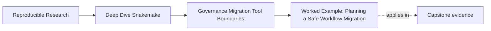
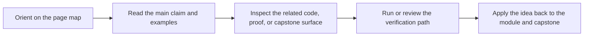

# Worked Example: Planning a Safe Workflow Migration

<!-- page-maps:start -->
## Page Maps

<!-- page-maps:end -->

This example shows how Module 10 works when a team wants change for good reasons but could
easily damage trust by moving too fast.

The point is not to memorize this exact sequence. The point is to see how review,
migration, governance, and tool-boundary judgment fit together in one real story.

## The situation

A team inherits a Snakemake repository with these characteristics:

- the workflow itself still runs reliably
- downstream notebooks read some files from `results/`
- `publish/v1/summary.json` is trusted, but the file API is incomplete
- one profile includes a sample filter that does not exist in the shared config contract
- report generation is hard to test and lives in a large helper script
- leadership wants the system "moved onto the platform"

That last sentence creates risk immediately, because it sounds larger than the actual
review has earned.

## Step 1: Review current truth before proposing change

The first task is not migration. It is review.

The review note says:

> The repository's strongest stable surface is the versioned publish bundle, but the public
> contract is weakened because some downstream consumers still read from `results/`. The
> profile boundary is also weak because one profile appears to change sample selection
> semantics. Report generation has a clear output surface but unclear implementation
> ownership.

That note already names three different problems:

- contract drift
- policy leakage
- hidden ownership

Without that review, the migration discussion would stay vague.

## Step 2: Decide what must not move first

Before discussing platform migration, the team writes down what must remain stable:

- `publish/v1/summary.json`
- `publish/v1/summary.tsv`
- the publish verification route
- the ability to compare profiles honestly

This is the crucial shift.

The migration is no longer "move onto the platform." It is now "keep trusted outputs and
proof routes stable while improving weak boundaries."

## Step 3: Sequence the boundary moves

A reckless plan would do all of this at once:

- redesign profiles
- move report code into a package
- change downstream consumers
- integrate platform submission

Instead, the team chooses this order:

1. repair the publish contract boundary
2. repair the policy leak
3. move report implementation behind the same output contract
4. decide what the external platform should own

That order matters because it fixes truth problems before it adds architectural movement.

## Step 4: Repair contract drift first

The team updates the file API and downstream review so that notebooks stop reading
`results/` directly.

Proof route used:

- `make verify-report`
- file API review
- downstream comparison against the publish bundle

This is not glamorous work, but it removes one of the biggest migration traps: hidden
consumers of internal state.

## Step 5: Move semantic settings out of profiles

The suspicious sample filter is moved into visible workflow or config surfaces, and the
profile is reduced back to operating policy.

Proof route used:

- `make profile-audit`
- dry-run comparison across profiles

At this point, the repository becomes easier to reason about even before any platform
handoff discussion.

## Step 6: Migrate implementation without changing outputs

Now the team moves report-generation logic from a large helper script into package code.

The important restraint is that they do not change:

- published file names
- published file meanings
- verification routes

They compare old and new report outputs and keep the same public boundary.

This is a real migration step because ownership moved, but proof stayed visible.

## Step 7: Revisit the platform request honestly

Only now does the team ask:

> what should the platform actually own?

The answer turns out to be narrower than the original request:

- Snakemake should keep owning sample discovery, orchestration, and publish artifacts
- the platform should own user-triggered requests, job submission policy, and access control

This is a hybrid answer, and it is the correct one.

The repository still explains workflow truth better than the platform would. The platform
explains service behavior better than the repository would.

## Step 8: Write governance rules so the problem does not return

The team records three rules:

1. downstream consumers must stay on the published contract
2. profiles may not change workflow meaning
3. migrations must preserve a comparison route until the new boundary earns trust

That is the part many teams skip. Without it, the same drift returns in six months.

## What this example teaches

This migration succeeds because the team refuses three common shortcuts:

- they do not start with platform migration language
- they do not move multiple weak boundaries at once
- they do not remove proof while the repository is in transition

Instead, they make the current system more legible, then move one boundary at a time.

## The pull-request note you would want

> This change is part of a staged migration, not a repository rewrite. We first repaired
> contract drift by moving downstream trust back onto the published bundle, then repaired a
> semantic policy leak by removing sample selection from the profile layer. This step moves
> report implementation ownership into package code while preserving the existing published
> outputs and verification route. The external platform remains out of scope for workflow
> truth and will own only request and access-control concerns in the later handoff.

That note is calm, specific, and reviewable.

## Why this is a mastery example

This one story exercises the whole module:

- Core 1: the review names current truth before redesign
- Core 2: the migration moves one boundary at a time
- Core 3: governance rules are written down
- Core 4: recurring anti-patterns are named as patterns
- Core 5: the tool-boundary decision becomes hybrid for clear reasons
