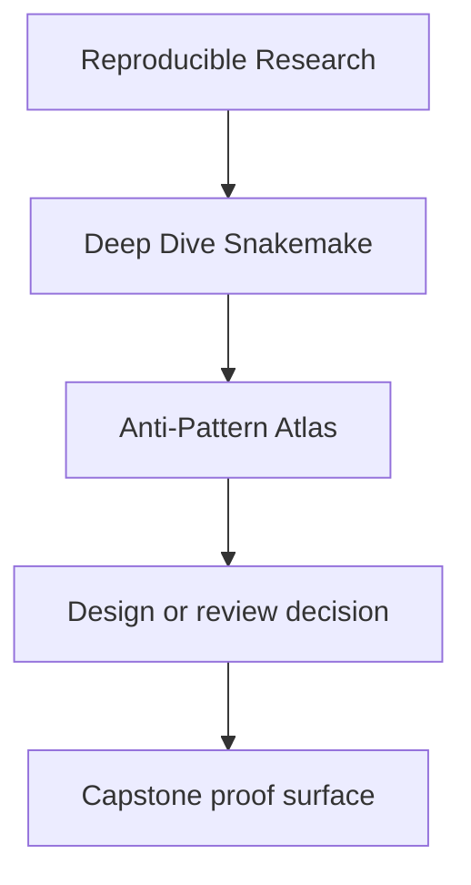
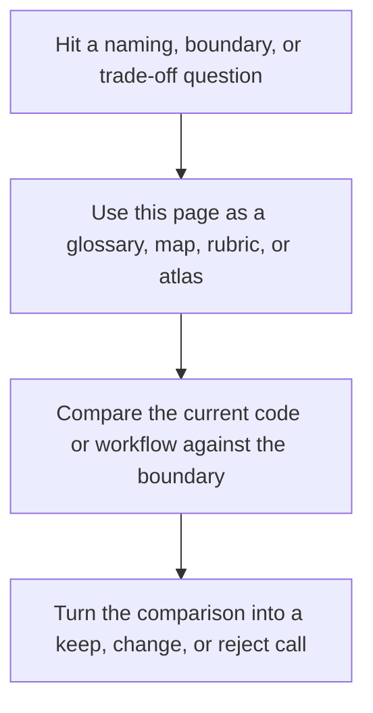

# Anti-Pattern Atlas

<!-- page-maps:start -->
## Reference Position

<!-- page-maps:end -->

Read the first diagram as a lookup map: this page is part of the review shelf, not a first-read narrative. Read the second diagram as the reference rhythm: arrive with a concrete ambiguity, compare the current work against the boundary on the page, then turn that comparison into a decision.

This page is the missing failure crosswalk for Deep Dive Snakemake. It exists because
humans rarely remember course structure by module title during a real workflow problem.
They remember symptoms, smells, and clumsy patterns.

Use this page when the question is “what kind of bad Snakemake idea is this?” rather than
“which module was that in?”

---

## Common Anti-Patterns

| Anti-pattern | Why it is clumsy | Primary modules | First proof or review route |
| --- | --- | --- | --- |
| shell scripts used as hidden workflow logic | the real contract disappears outside the DAG | 01, 05 | `capstone-walkthrough` |
| checkpoints used as magic rather than staged discovery | the plan becomes opaque and unstable | 02 | `test` |
| profiles used to smuggle semantic changes | execution policy starts mutating workflow meaning | 03, 08 | `capstone-profile-audit` |
| modularity that hides the real file API | larger repositories become harder, not easier, to review | 04, 07 | `capstone-tour` |
| wrappers and envs treated as unquestioned truth | software boundaries become tribal instead of reviewable | 05 | `proof` |
| publish directories treated as informal output piles | downstream trust becomes accidental | 06 | `capstone-verify-report` |
| architecture pages that do not match code ownership | repository review becomes ceremonial | 07, 10 | `proof` |
| executor differences mistaken for workflow semantics | context drift is normalized instead of bounded | 08 | `capstone-profile-audit` |
| logs and benchmarks collected without a review route | incidents stay noisy instead of explainable | 09 | `proof` |
| Snakemake kept as owner after its boundary is exceeded | governance and migration drift become chronic | 10 | `capstone-confirm` |

[Back to top](#top)

---

## Symptom To Anti-Pattern

| Symptom | Likely anti-pattern | Better question |
| --- | --- | --- |
| “the workflow only works with this one command line” | policy is leaking into semantics | which setting belongs in a profile or file contract |
| “the checkpoint feels magical” | staged discovery is not explicit enough | where is the discovered set recorded and reviewed |
| “the outputs exist, but I do not trust them” | publish contract is weak or informal | what stable surface proves downstream trust |
| “the repository is modular, but I still do not know where to change it” | architecture boundaries are blurry | which file API or layer owns the change |
| “the incident evidence is there, but I still cannot diagnose it” | observability lacks a review route | what narrower review surface should I inspect first |

[Back to top](#top)

---

## Repair Direction

When you identify an anti-pattern, do not jump straight to rewriting everything.

Use this order:

1. name the failure class precisely
2. find the matching module and capstone review route
3. inspect the owning boundary
4. apply the narrowest repair that restores workflow truth

This keeps the course aligned with real maintenance work instead of theatrical refactoring.

[Back to top](#top)

---

## Best Companion Pages

Use these with the atlas:

* [`boundary-map.md`](boundary-map.md) for workflow-boundary review
* [`module-dependency-map.md`](module-dependency-map.md) for where the idea is taught in sequence
* [`capstone-map.md`](../guides/capstone-map.md) for module-aware workflow routing
* [`incident-review-guide.md`](../guides/incident-review-guide.md) for a narrower incident review surface

[Back to top](#top)
