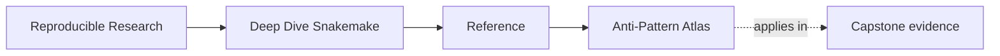

# Anti-Pattern Atlas

<!-- page-maps:start -->
## Page Maps

<!-- page-maps:end -->

Use this page when you recognize the smell before you remember the module. A useful
atlas turns "this workflow feels wrong" into a smaller statement about hidden logic,
checkpoint abuse, profile drift, weak publish contracts, or ownership collapse.

---

## Symptom-led lookup

| Symptom | Likely failure class | Ask this next | First route |
| --- | --- | --- | --- |
| the workflow only makes sense if someone explains it out loud | hidden logic escaped the DAG | which behavior lives in shell or helper code instead of visible rule contracts | `make walkthrough` |
| the checkpoint feels magical | staged discovery is not explicit enough | where is the discovered sample set recorded and reviewed | `make walkthrough` |
| a profile change changed results, not just execution context | policy leaked into semantics | which setting should have stayed in workflow or config, not a profile | `make profile-audit` |
| outputs exist but still do not feel trustworthy downstream | publish contract is weaker than execution evidence | which file or check actually defines downstream trust | `make verify-report` |
| the repository is modular, but no one knows where a change belongs | ownership boundaries are blurry | which layer should own workflow meaning, helper code, or policy | `make tour` |
| logs are everywhere, but incident review is still vague | evidence lacks a review route | which smaller bundle or guide should answer the current question first | `make proof` |

---

## Recurring failure classes

| Failure class | Why it matters | Where the course or capstone teaches the repair |
| --- | --- | --- |
| hidden workflow logic in shell or helper code | readers stop being able to trust the DAG by inspection | modules 01 and 05, `WALKTHROUGH_GUIDE.md` |
| checkpoint discovery used as a black box | dynamic behavior becomes harder to audit than it needs to be | module 02, `WALKTHROUGH_GUIDE.md` |
| profiles used to carry semantic differences | execution context starts changing analytical meaning | modules 03 and 08, `PROFILE_AUDIT_GUIDE.md` |
| modularity that hides the file contract | a larger repository becomes less legible instead of more | modules 04 and 07, `ARCHITECTURE.md` |
| publish directories treated as informal output piles | downstream trust becomes accidental | module 06, `FILE_API.md`, `PUBLISH_REVIEW_GUIDE.md` |
| governance questions left until after drift is visible | stewardship turns reactive and expensive | module 10, `EXTENSION_GUIDE.md` |

---

## Repair order

When you identify a likely anti-pattern:

1. name the failure class in one sentence
2. point to the output, config, or boundary that is lying
3. choose the smallest capstone route that demonstrates the same defect or claim
4. repair the contract before polishing the implementation

---

## Companion pages

- [`review-checklist.md`](review-checklist.md)
- [`boundary-review-prompts.md`](boundary-review-prompts.md)
- [`module-dependency-map.md`](module-dependency-map.md)
