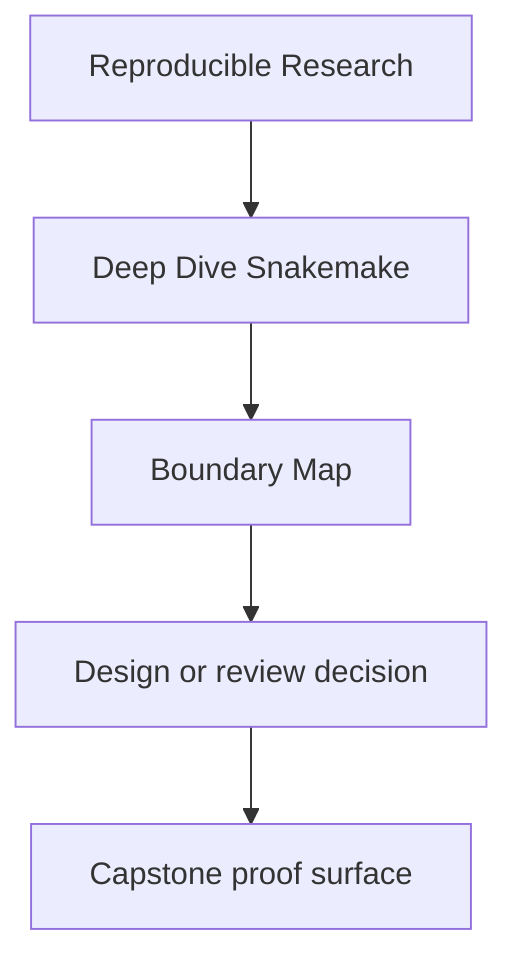
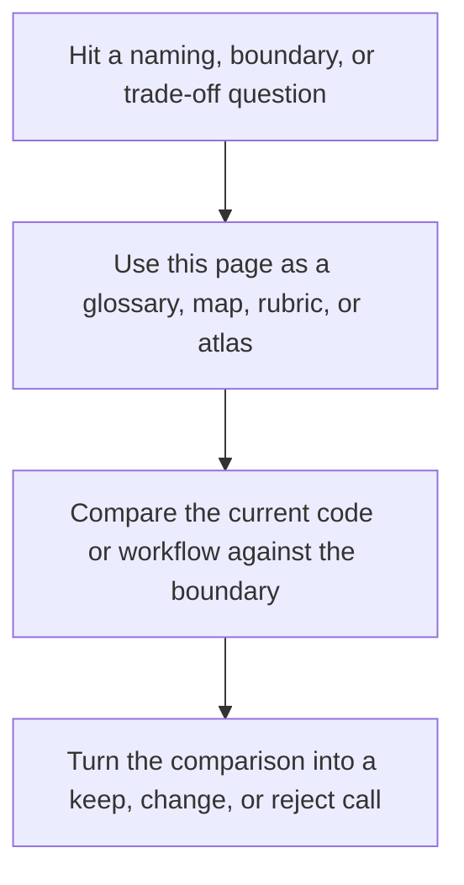

# Boundary Map

<!-- page-maps:start -->
## Reference Position

<!-- page-maps:end -->

Read the first diagram as a lookup map: this page is part of the review shelf, not a first-read narrative. Read the second diagram as the reference rhythm: arrive with a concrete ambiguity, compare the current work against the boundary on the page, then turn that comparison into a decision.

Deep Dive Snakemake repeatedly asks which surface is authoritative for a workflow
question. This page answers that directly.

Use it when the repository contains many files but you need to know which one is supposed
to settle a trust question.

---

## Workflow Surfaces And Their Jobs

| Surface | What it is authoritative for | What it is not authoritative for |
| --- | --- | --- |
| `Snakefile` and included rule files | the declared workflow graph and rule contracts | downstream trust by themselves |
| checkpoint artifacts such as discovered-set files | explicit evidence for dynamic discovery | permission to hide moving targets |
| `profiles/` | operating policy such as executor, retries, and latency settings | scientific or analytical workflow meaning |
| `FILE_API.md` | the documented public file contract | full internal repository behavior |
| `publish/v1/` | stable downstream-facing outputs and evidence bundle | all intermediate execution state |
| logs, benchmarks, and summaries | review and incident evidence | the public downstream interface |

[Back to top](#top)

---

## Which Surface Answers Which Question

| Question | Start with |
| --- | --- |
| what does this workflow claim it will build | `Snakefile` and `workflow/rules/` |
| what did dynamic discovery actually reveal | the discovered-set artifact and the checkpoint boundary |
| what changed when moving from local execution to CI or SLURM | `profiles/` |
| which outputs are safe for downstream users to trust | `FILE_API.md` and `publish/v1/` |
| what evidence helps explain a slow or surprising run | logs, benchmarks, and summary surfaces |

[Back to top](#top)

---

## Common Boundary Mistakes

| Mistake | Why it fails |
| --- | --- |
| treating a profile change as harmless when it changes workflow meaning | policy leaked into semantics |
| treating a checkpoint as a license for hidden discovery | the DAG becomes harder to review and trust |
| treating `results/` as if it were a downstream contract | internal state becomes accidental API |
| treating logs as the public interface | diagnostic evidence is not the same thing as a publish boundary |

[Back to top](#top)

---

## Best Companion Pages

Use these pages with this map:

* [`glossary.md`](glossary.md)
* [`module-03-production-operations-policy-boundaries/index.md`](../module-03-production-operations-policy-boundaries/index.md)
* [`module-06-publishing-downstream-contracts/index.md`](../module-06-publishing-downstream-contracts/index.md)
* [`capstone-map.md`](../capstone/capstone-map.md)

[Back to top](#top)
