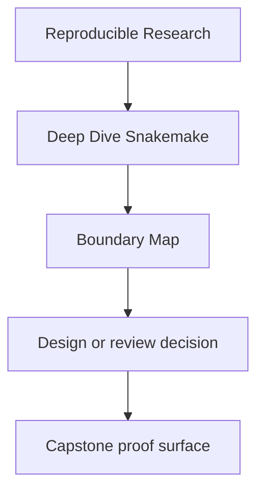
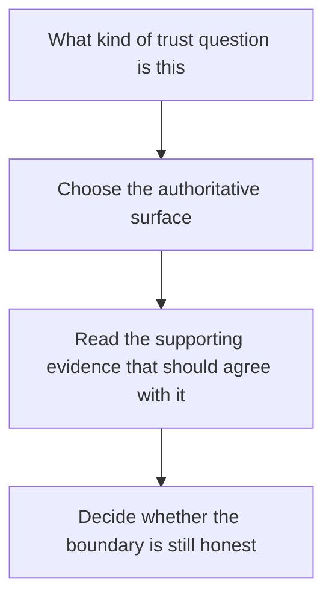

# Boundary Map

<!-- page-maps:start -->
## Reference Position

<!-- page-maps:end -->

Deep Dive Snakemake only stays reviewable if each kind of question has a clear owner.
Use this page when the repository contains many plausible answers, but you need to know
which surface is actually allowed to settle the question.

---

## Which surface settles which question

| Question | Authoritative surface | Supporting evidence |
| --- | --- | --- |
| what does the workflow claim it will build | `Snakefile` and `workflow/rules/` | `list-rules.txt`, `dryrun.txt` |
| what did checkpoint discovery actually decide | `discovered_samples.json` and the checkpoint-owning rules | `WALKTHROUGH_GUIDE.md`, `Snakefile` |
| which differences are execution policy rather than workflow meaning | `profiles/` plus validated config | `PROFILE_AUDIT_GUIDE.md`, dry-run comparisons |
| which files are safe for downstream trust | `FILE_API.md` and `publish/v1/` | `verify.json`, `manifest.json`, `PUBLISH_REVIEW_GUIDE.md` |
| what happened during an executed run | `run.txt`, `summary.txt`, logs, and benchmarks | `TOUR.md`, `PROOF_GUIDE.md` |
| where should a future change land | repository layer ownership | `ARCHITECTURE.md`, `EXTENSION_GUIDE.md` |

---

## Common boundary mistakes

| Mistake | Why it lowers trust |
| --- | --- |
| treating a profile change as semantically harmless without comparing dry-runs | policy can leak into meaning without anyone naming it |
| treating checkpoints as permission to rediscover inputs ad hoc | the dynamic part of the DAG becomes harder to audit |
| treating `results/` as if it were the downstream contract | internal workflow state turns into accidental public API |
| treating logs as the only trustworthy evidence | diagnostic output is not a substitute for a published contract |
| treating README prose as stronger than the workflow or the published files | trust shifts from executed evidence back to narration |

---

## Boundary tests

Ask these before you change a file or trust a claim:

1. which surface is allowed to define the meaning here
2. which artifact or bundle should agree with that source
3. who is the reader: workflow maintainer, operator, or downstream consumer
4. would this still be reviewable if the logs disappeared

---

## How far to split the workflow

Use this section when a workflow is growing and the real question is not "can we split
it?" but "which split keeps the workflow more legible than it is today?"

Start with the decision, not the tool:

1. what ownership boundary is currently hard to review
2. what would a new file make clearer that is currently blurry

If you cannot answer those, the split is probably about discomfort, not design.

| If the real need is... | Prefer this level | What it should own | What it must not hide |
| --- | --- | --- | --- |
| one small workflow with obvious rule relationships | a single `Snakefile` | the visible graph and top-level intent | architecture complexity for its own sake |
| grouping coherent rule families in one repository | `include:` files under `workflow/rules/` | rules that share one clear contract or stage | cross-cutting defaults that only make sense after oral explanation |
| reusing a workflow bundle with an explicit interface | `workflow/modules/` | a named boundary with declared inputs and outputs | the real DAG shape or the consumer-facing file contract |
| moving non-trivial implementation out of rule bodies | `workflow/scripts/` or `src/` | computation and reusable program logic | silent workflow semantics that disappear from the rule surface |
| changing run context without changing meaning | `profiles/` | execution policy, resources, retries, and executor settings | analytical meaning or published output contracts |

Fast decision rules:

- stay in one `Snakefile` while the graph is still easier to review than the split
- use `include:` when the new file mirrors a rule family a reviewer can name in one sentence
- use `workflow/modules/` only when the module has a stable interface and a consumer can explain it
- move logic into `workflow/scripts/` or `src/` when the code is real software, not just shell glue
- keep `profiles/` for operating policy only; if a profile change alters workflow meaning, the boundary is wrong

---

## Companion pages

- [`repository-layer-guide.md`](repository-layer-guide.md)
- [`anti-pattern-atlas.md`](anti-pattern-atlas.md)
- [`glossary.md`](glossary.md)
