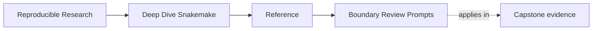
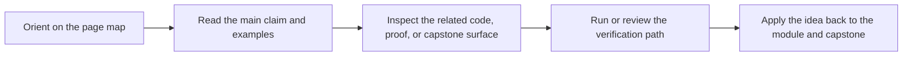

# Boundary Review Prompts

<!-- page-maps:start -->
## Page Maps

<!-- page-maps:end -->

Use this page when a Snakemake review needs sharper keep, change, or reject questions
tied to workflow boundaries.

## Workflow versus policy

- Does this change alter workflow meaning or only execution policy?
- Would a dry-run reveal the important part of the behavior honestly?
- Has a profile started carrying semantic meaning it should not own?

## Discovery versus folklore

- Does dynamic discovery leave a durable artifact that another reviewer can inspect?
- Which rule or artifact actually settles the discovered set?
- Would the workflow still be reviewable if logs were missing?

## Publish and repository boundaries

- Is the published contract smaller and clearer than the whole repository?
- Which layer should own this behavior: `Snakefile`, rules, modules, scripts, package code, or profiles?
- What ambiguity would make you reject the current boundary as too blurry to trust?

## Authority prompts

- Which surface is actually allowed to settle this trust question?
- Is this claim being supported by workflow contracts, durable artifacts, or only logs and memory?
- Would the repository still be reviewable if runtime output disappeared?
