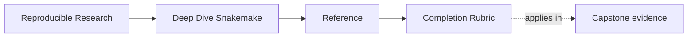
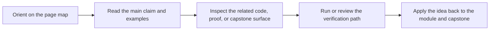

# Completion Rubric

<!-- page-maps:start -->
## Page Maps

<!-- page-maps:end -->

Read the first diagram as a lookup map: this page is part of the review shelf, not a first-read narrative. Read the second diagram as the reference rhythm: arrive with a concrete ambiguity, compare the current work against the boundary on the page, then turn that comparison into a decision.

Deep Dive Snakemake should finish with more than syntax familiarity.

Use this rubric to judge whether you can reason about workflow truth, dynamic
behavior, policy boundaries, and publish contracts without hand-waving.

---

## Completion Standard

You should be able to do all of the following:

* explain why a workflow reruns with evidence rather than intuition
* distinguish rule semantics from profile or executor policy
* describe what a checkpoint may discover and what it must never hide
* identify which outputs are internal versus safe for downstream trust
* explain which artifacts another reviewer should inspect before approving change

---

## Course Outcomes

| Area | Completion signal |
| --- | --- |
| file contracts | you can explain which paths are explicit contracts and why they matter |
| dynamic DAG behavior | you can describe the checkpoint boundary and its evidence surfaces clearly |
| operational policy | you can show which profile changes are safe and which would leak into semantics |
| publish boundaries | you can defend the public file API and the promoted evidence bundle |
| stewardship | you can review the workflow for drift, risk, and migration pressure |

---

## Capstone Evidence

Use these proof routes as the minimum capstone evidence:

1. `make PROGRAM=reproducible-research/deep-dive-snakemake capstone-walkthrough`
2. `make PROGRAM=reproducible-research/deep-dive-snakemake capstone-tour`
3. `make PROGRAM=reproducible-research/deep-dive-snakemake capstone-verify-artifacts`
4. `make PROGRAM=reproducible-research/deep-dive-snakemake capstone-confirm`

You are not done if you ran them mechanically but cannot explain what each one proved.

---

## Reviewer Questions

A reviewer should be able to ask:

* what this workflow claims to build
* what dynamic discovery is allowed to do here
* what is public for downstream trust
* what changed when moving between local and CI policy
* what would you inspect first before migration

If those answers stay vague, you are not done yet.
