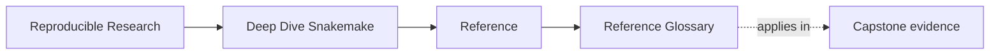
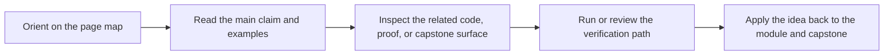

# Reference Glossary

<!-- page-maps:start -->
## Page Maps

<!-- page-maps:end -->

This glossary keeps Deep Dive Snakemake's recurring terms stable across modules,
reference pages, and capstone review routes. Use it when the repository is clear enough
to inspect, but the local meaning of a word still needs to be pinned down.

## How to use this glossary

Open it when a term matters for a decision: where a change belongs, which surface is
authoritative, or which proof route should answer the question. Do not read it as a list
to memorize.

## Terms in this directory

| Term | Meaning in Deep Dive Snakemake |
| --- | --- |
| Anti-Pattern Atlas | A symptom-led catalog of recurring workflow mistakes, used when you recognize the smell before you remember the lesson that explains it. |
| Completion Rubric | The review standard for deciding whether someone can explain workflow behavior with evidence rather than slogans. |
| Module Dependency Map | The reading-order map that shows which modules support later ones and which ideas should come first. |
| Practice Map | The crosswalk from modules to capstone routes that corroborate the same concept. |
| Topic Boundaries | The page that distinguishes core course material from supporting context and out-of-scope extension work. |
