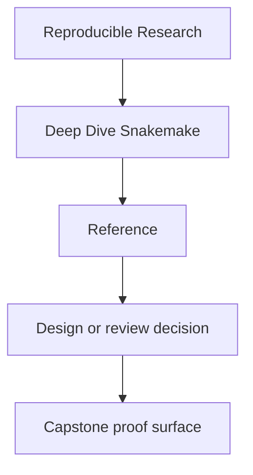
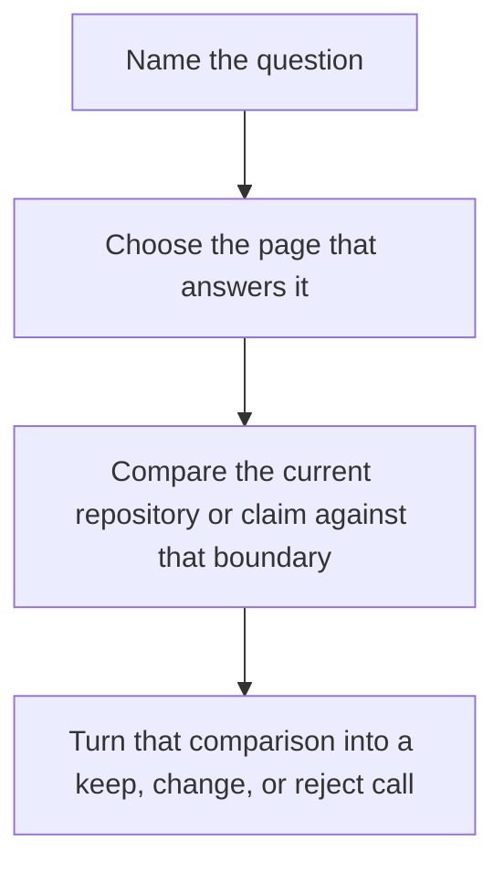

# Reference

<!-- page-maps:start -->
## Reference Position

<!-- page-maps:end -->

This shelf is for recurring questions, not first exposure. Use it when you already know
roughly what the course is teaching and need a durable answer about language, ownership,
workflow boundaries, or review routes.

## Start here by question

| If the question is... | Start here | Then read |
| --- | --- | --- |
| what does this term mean locally | [Glossary](glossary.md) | the page or module that used it |
| where does this idea sit in the course | [Module Dependency Map](module-dependency-map.md) | [Practice Map](practice-map.md) |
| which surface is authoritative for this trust question | [Boundary Map](boundary-map.md) | [Repository Layer Guide](repository-layer-guide.md) |
| what kind of workflow mistake am I seeing | [Anti-Pattern Atlas](anti-pattern-atlas.md) | the matching module or capstone guide |
| what should count as finished understanding | [Completion Rubric](completion-rubric.md) | the capstone route that corroborates it |

## What these pages are for

- vocabulary that stays stable across modules and capstone review
- ownership maps for workflow meaning, policy, and downstream trust
- symptom-led routes into common Snakemake mistakes
- standards for deciding whether learning or review work is actually complete

## What this shelf is not for

Do not use these pages as a substitute for the modules when the underlying concept is
still new. These pages compress decisions and boundaries. They work best after at least
one full read of the relevant lesson or capstone guide.

## Reference pages

- [Glossary](glossary.md)
- [Topic Boundaries](topic-boundaries.md)
- [Module Dependency Map](module-dependency-map.md)
- [Practice Map](practice-map.md)
- [Boundary Map](boundary-map.md)
- [Repository Layer Guide](repository-layer-guide.md)
- [Anti-Pattern Atlas](anti-pattern-atlas.md)
- [Completion Rubric](completion-rubric.md)

[Back to top](#top)
