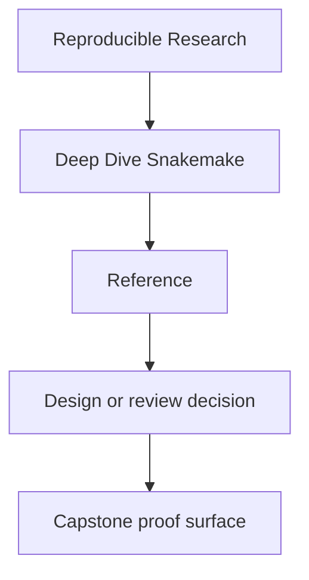
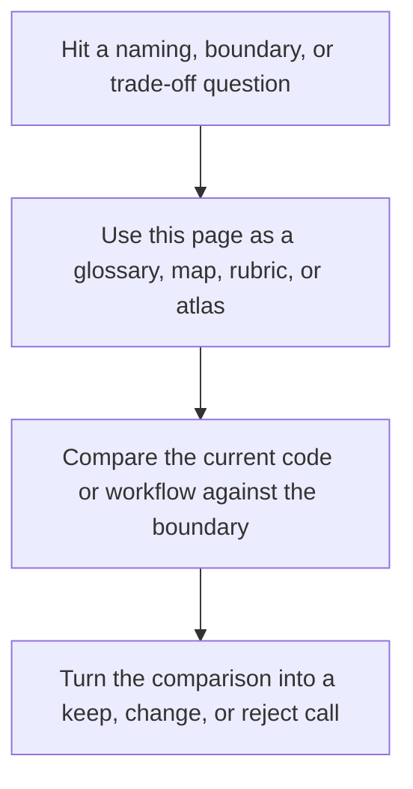

# Reference

<!-- page-maps:start -->
## Reference Position

<!-- page-maps:end -->

Read the first diagram as a lookup map: this page is part of the review shelf, not a first-read narrative. Read the second diagram as the reference rhythm: arrive with a concrete ambiguity, compare the current work against the boundary on the page, then turn that comparison into a decision.

Use this page when you already know the course flow and need a stable reference surface
instead of a learner-entry guide.

---

## Vocabulary And Concepts

* [Workflow Glossary](workflow-glossary.md)
* [Topic Boundaries](topic-boundaries.md)

[Back to top](#top)

---

## Study And Proof Routing

* [Module Dependency Map](module-dependency-map.md)
* [Practice Map](practice-map.md)
* [Anti-Pattern Atlas](anti-pattern-atlas.md)

[Back to top](#top)

---

## Boundary And Repository Review

* [Boundary Map](boundary-map.md)
* [Repository Layer Guide](repository-layer-guide.md)

[Back to top](#top)

---

## Completion And Stewardship

* [Completion Rubric](completion-rubric.md)

[Back to top](#top)
