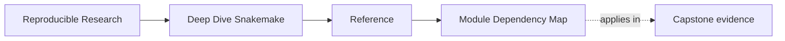
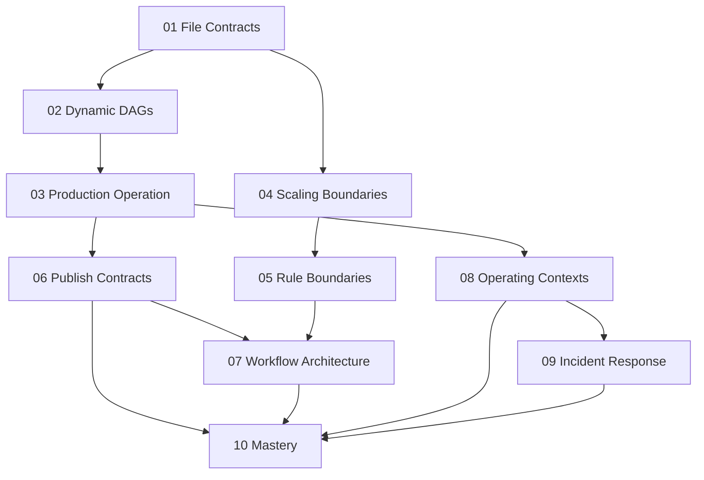

# Module Dependency Map

<!-- page-maps:start -->
## Page Maps

<!-- page-maps:end -->

Read the first diagram as a lookup map: this page is part of the review shelf, not a first-read narrative. Read the second diagram as the reference rhythm: arrive with a concrete ambiguity, compare the current work against the boundary on the page, then turn that comparison into a decision.

Deep Dive Snakemake is easier to learn when you can see which ideas are
prerequisites and which ideas are extensions.

This page makes that structure explicit.

---

## The Main Sequence

---

## Why The Sequence Looks Like This

| Module | Depends most on | Reason |
| --- | --- | --- |
| 01 File Contracts | none | it establishes that outputs, wildcards, and published paths are explicit contracts |
| 02 Dynamic DAGs | 01 | dynamic behavior only stays trustworthy when file contracts are already clear |
| 03 Production Operation | 01-02 | profiles, proof targets, and operational evidence depend on a truthful graph |
| 04 Scaling Boundaries | 01 | scaling boundaries matter only after you can already reason about files and rules |
| 05 Rule Boundaries | 01-04 | script boundaries and environment choices are safer once architectural limits are understood |
| 06 Publish Contracts | 01-03 | publish surfaces depend on trustworthy execution and explicit output meaning |
| 07 Workflow Architecture | 04-06 | repository structure is easiest to judge after boundaries and publish contracts are concrete |
| 08 Operating Contexts | 03-07 | policy and executor changes make sense only after the workflow and repository are stable |
| 09 Incident Response | 03-08 | incident response needs evidence, policy, and architecture to already exist |
| 10 Mastery | all earlier modules | migration and governance require the full mental model |

---

## Fastest Safe Paths

### First-time reader

Read in order from Module 01 through Module 10.

### Working maintainer

Start with Modules 03, 06, 08, and 09, then return to Modules 01 and 02 whenever the
workflow graph or output contract becomes unclear.

### Workflow steward

Start with Modules 04, 05, 07, 09, and 10, then backfill earlier modules when a boundary
decision depends on file or DAG truth.

---

## Where The Capstone Helps Most

| Stage | Best capstone use |
| --- | --- |
| after 01-02 | inspect `Snakefile`, rule outputs, and discovery surfaces with dry-runs |
| after 03-05 | compare profiles, helper boundaries, and `FILE_API.md` deliberately |
| after 06-08 | inspect publish artifacts, profile policy, and workflow layout as one system |
| after 09-10 | use tests, verification targets, and governance questions as a review specimen |
