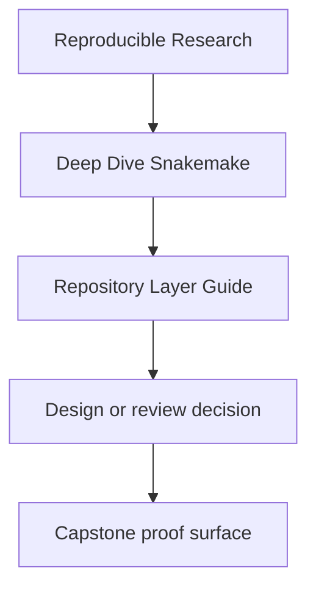
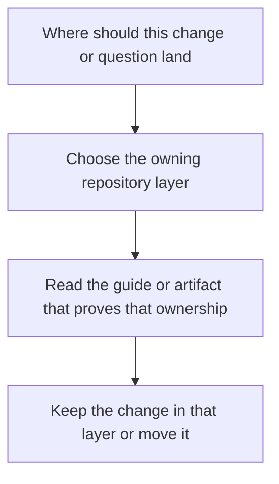

# Repository Layer Guide

<!-- page-maps:start -->
## Reference Position

<!-- page-maps:end -->

Use this page when `Snakefile`, `workflow/rules/`, `workflow/modules/`, `workflow/scripts/`,
`src/capstone/`, `profiles/`, and `config/` all look plausible. The point is to assign
ownership before the repository grows another ambiguous layer.

---

## Read the repository in this order

1. `capstone/Snakefile`
2. `capstone/workflow/rules/`
3. `capstone/workflow/modules/`
4. `capstone/workflow/scripts/`
5. `capstone/src/capstone/`
6. `capstone/profiles/`
7. `capstone/config/`

That route moves from visible orchestration to helper structure, then to reusable code,
and only then to operating policy.

[Back to top](#top)

---

## What each layer owns

| Path | Owns | Should not absorb |
| --- | --- | --- |
| `Snakefile` | visible workflow assembly and top-level story | helper logic that hides the DAG behind indirection |
| `workflow/rules/` | rule-family contracts, file paths, logs, and benchmarks | reusable processing code that belongs in scripts or Python modules |
| `workflow/modules/` | grouped workflow structure that keeps larger rule sets legible | abstractions so indirect that readers stop being able to trace outputs |
| `workflow/scripts/` | orchestration-adjacent helpers called by rules | application logic that deserves tests and package boundaries |
| `src/capstone/` | reusable implementation code with explicit interfaces | policy, profile, or publish-boundary choices |
| `profiles/` | execution context and resource policy | analytical meaning or hidden semantic switches |
| `config/` | validated workflow inputs | ad hoc knobs that bypass documented contracts |

[Back to top](#top)

---

## Ownership tests

Before adding or moving code, ask:

1. is this changing workflow meaning, operating policy, or reusable implementation
2. should a dry-run reveal this behavior, or only the helper code
3. which guide would you point a reviewer to first
4. if this file disappeared, what kind of question would become impossible to answer

[Back to top](#top)

---

## Companion pages

- [`boundary-map.md`](boundary-map.md)
- [`anti-pattern-atlas.md`](anti-pattern-atlas.md)
- [`completion-rubric.md`](completion-rubric.md)

[Back to top](#top)
