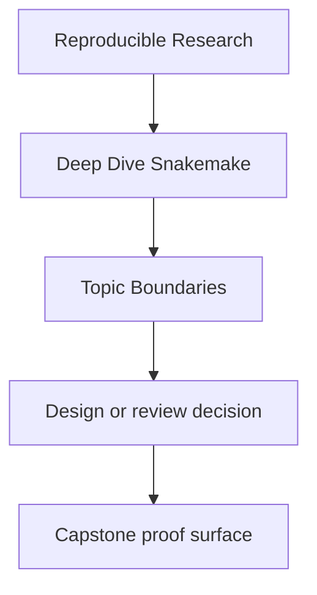
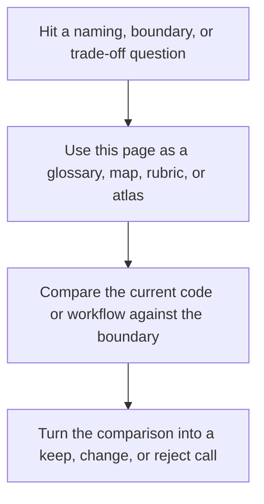

# Topic Boundaries

<!-- page-maps:start -->
## Reference Position

<!-- page-maps:end -->

Read the first diagram as a lookup map: this page is part of the review shelf, not a first-read narrative. Read the second diagram as the reference rhythm: arrive with a concrete ambiguity, compare the current work against the boundary on the page, then turn that comparison into a decision.

This page answers a question the course currently implies more than it states: which
Snakemake topics are central to this program, which ones support the core, and which ones
are deliberately treated as boundaries rather than as the center of the curriculum.

Use it when the course feels selective and you want that selectivity to be explicit
instead of accidental.

---

## Core Topics This Course Must Teach Well

These are the non-negotiable topics. If these stay fuzzy, the course is not doing its
job.

| Topic family | Why it is core | Primary modules | Typical proof |
| --- | --- | --- | --- |
| file-contract truth | Snakemake only stays trustworthy when rule I/O is explicit | 01, 02 | dry-run review, stable targets, publish surfaces |
| dynamic DAG discipline | checkpoints are where workflows often become magical and unsafe | 02 | discovery artifact review, checkpoint evidence |
| policy versus semantics | profiles and executors should change context, not meaning | 03, 08 | profile audit, compare local and CI policy |
| repository boundaries | larger workflows need legible file APIs and module ownership | 04, 07 | architecture route, repository layer review |
| software and helper-code boundaries | wrappers, scripts, and envs must stay reviewable | 05 | environment and script boundary review |
| publish and downstream contracts | downstream trust depends on a deliberate stable interface | 06 | publish review, manifest and report evidence |
| incident response and stewardship judgment | a workflow must stay reviewable under pressure and change | 09, 10 | incident review, governance pass |

[Back to top](#top)

---

## Supporting Topics That Matter, But Serve The Core

These matter because they make the core topics legible and enforceable.

| Topic family | How this course uses it | Where it appears |
| --- | --- | --- |
| dry-runs and summaries | to explain planned work before execution | Modules 01, 03, 09 |
| rule modularity | to keep larger repositories reviewable | Modules 04, 07 |
| resource declarations | to make execution assumptions visible | Modules 03, 08 |
| logs and benchmarks | to turn workflow incidents into inspectable evidence | Module 09 |
| manifests and checksums | to make publication reviewable | Module 06 |
| Docker and execution surfaces | to expose runtime boundaries honestly | Modules 05, 08 |

These are important, but they are always in service of a more trustworthy workflow.

[Back to top](#top)

---

## Boundaries This Course Names Deliberately

These topics are real, but they are not treated as the main point of Deep Dive
Snakemake.

| Boundary topic | Why it is not the center of this course | What we do instead |
| --- | --- | --- |
| biological analysis depth | this course is about workflow engineering, not domain-science interpretation | keep biology minimal and use it as pressure, not as the main subject |
| Python library design in the abstract | helper code matters only where it affects workflow truth | teach helper-code boundaries, not a general Python architecture course |
| cluster administration | scheduler policy matters, but workflow semantics come first | teach profile and executor boundaries, not admin operations in the large |
| container ecosystem debates | containers matter as execution boundaries, not as the full course topic | keep focus on reproducible runtime surfaces |
| general data-versioning systems | Snakemake has limits and neighbors | Module 10 teaches tool boundaries instead of pretending Snakemake owns everything |

When a learner wants more on one of these, the honest answer is not “the course covers
everything.” The honest answer is “the course touches this where it affects workflow
truth, then hands off.”

[Back to top](#top)

---

## Topics People Often Overweight

These topics are easy to romanticize and easy to teach badly:

* wrappers treated as a substitute for understanding rule contracts
* checkpoints treated as cleverness instead of explicit staged discovery
* executor flags treated as workflow semantics
* results directories treated as published interfaces
* modularization treated as virtue even when the repository contract gets blurrier

The course mentions these only when they sharpen workflow judgment. It does not treat
them as badges of Snakemake sophistication.

[Back to top](#top)

---

## Blind Spots This Page Protects Against

Without an explicit boundary page, learners can leave with the wrong conclusions:

* “The course forgot science-domain concerns.”
  It did not forget them. It scoped them outside the central workflow argument.
* “The course should teach every Snakemake feature equally.”
  It should not. Some features matter far more to correctness than others.
* “If the workflow runs once locally, the advanced topics are optional.”
  They are not. Production truth appears later, under policy drift and review pressure.
* “Snakemake should keep owning every orchestration concern forever.”
  Module 10 exists precisely to prevent that mistake.

[Back to top](#top)

---

## Best Companion Pages

Use these with this page:

* [`glossary.md`](glossary.md) to revisit the shared vocabulary
* [`module-dependency-map.md`](module-dependency-map.md) to see the safe learning order
* [`capstone-map.md`](../capstone/capstone-map.md) to choose the smallest honest workflow proof route
* [`completion-rubric.md`](completion-rubric.md) to review whether the course is actually keeping its promises

[Back to top](#top)
