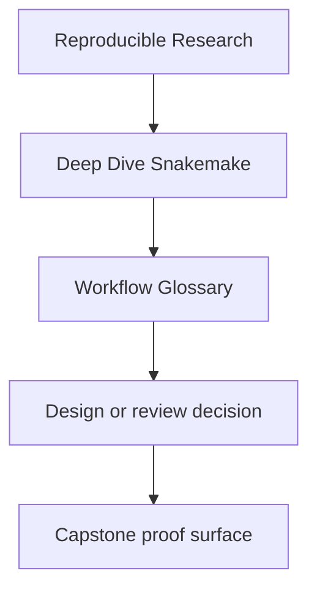
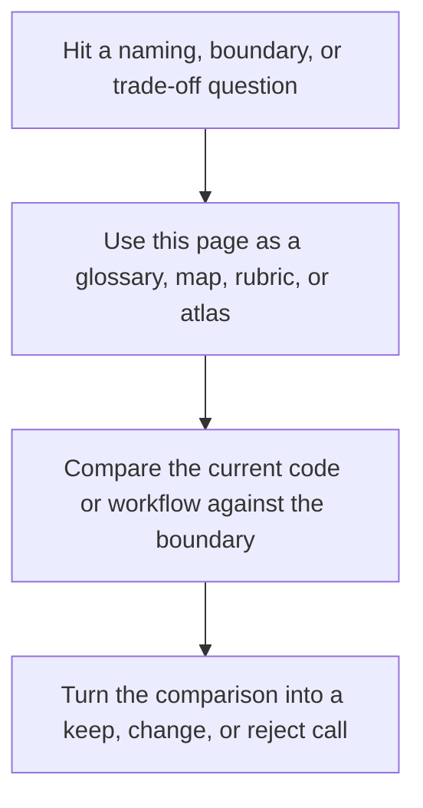

# Workflow Glossary

<!-- page-maps:start -->
## Reference Position

<!-- page-maps:end -->

Read the first diagram as a lookup map: this page is part of the review shelf, not a first-read narrative. Read the second diagram as the reference rhythm: arrive with a concrete ambiguity, compare the current work against the boundary on the page, then turn that comparison into a decision.

This glossary keeps the course language stable.

The goal is not to define every Snakemake feature. The goal is to define the workflow
terms this program relies on for reasoning, review, and migration.

---

## Contract Terms

| Term | Meaning in this course |
| --- | --- |
| file contract | the declared path, pattern, and meaning that a rule promises to produce |
| publish boundary | the stable downstream surface another human or system is allowed to trust |
| public file API | the documented file paths and formats that consumers may rely on intentionally |
| internal state | workflow outputs, logs, and helper artifacts that support execution but are not the downstream promise |
| versioned publish surface | a published directory tree whose stability is expressed by version, not assumption |

[Back to top](#top)

---

## Execution Terms

| Term | Meaning in this course |
| --- | --- |
| truthful DAG | a dependency graph that exposes the real change surface instead of hiding it in scripts or side effects |
| dynamic discovery | revealing additional work from declared upstream state without turning the workflow into guesswork |
| checkpoint contract | the rule boundary that records what discovery may expand and what evidence must remain reviewable |
| profile policy | execution settings that change operating context without changing workflow meaning |
| failure discipline | explicit rules for retries, latency, incomplete outputs, and cleanup that do not hide correctness problems |

[Back to top](#top)

---

## Stewardship Terms

| Term | Meaning in this course |
| --- | --- |
| workflow architecture | the repository structure that shows where orchestration, helpers, config, and published contracts live |
| rule boundary | the line between orchestration logic inside Snakemake and implementation logic inside scripts or packages |
| evidence surface | the manifests, summaries, logs, tests, and reports that explain why a run should be trusted |
| incident ladder | a fixed sequence for collecting evidence before changing workflow code or policy |
| governance rule | a durable review expectation that protects workflow truth as the repository grows |

[Back to top](#top)

---

## Terms Often Confused

| Pair | Course distinction |
| --- | --- |
| file contract vs publish boundary | a file contract describes a produced output; a publish boundary describes which outputs are trusted downstream |
| dynamic discovery vs hidden side effect | dynamic discovery is declared and reviewable; a hidden side effect changes the graph without a visible contract |
| profile policy vs workflow semantics | profile policy changes where or how the workflow runs; workflow semantics define what the workflow means |
| public file API vs convenient path | a public file API is intentionally documented; a convenient path may disappear without notice |
| observability surface vs noise | an observability surface helps explain behavior; noise adds files without helping review or diagnosis |

[Back to top](#top)
