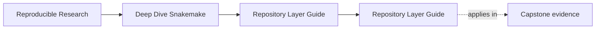
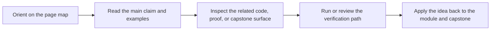

# Repository Layer Guide

<!-- page-maps:start -->
## Page Maps

<!-- page-maps:end -->

Deep Dive Snakemake uses several repository layers on purpose. This page explains what
each layer owns so the capstone stays legible as the learner moves past the top-level
workflow entrypoint.

Use it when `workflow/`, `src/`, `profiles/`, and `config/` feel like parallel folders
instead of an intentional architecture.

---

## Reading Order

Read the repository layers in this order:

1. `capstone/Snakefile`
2. `capstone/workflow/rules/`
3. `capstone/workflow/modules/`
4. `capstone/workflow/scripts/`
5. `capstone/src/capstone/`
6. `capstone/profiles/`
7. `capstone/config/`

That order moves from orchestration entrypoint, to rule families, to modular grouping,
to workflow-adjacent helpers, to reusable implementation code, to operating policy, and
finally to declared configuration.

[Back to top](#top)

---

## Layer Responsibilities

| Path | Responsibility |
| --- | --- |
| `Snakefile` | repository entrypoint and visible workflow assembly |
| `workflow/rules/` | rule families and declared file contracts |
| `workflow/modules/` | reusable workflow bundles that keep repository growth legible |
| `workflow/scripts/` | workflow-adjacent helpers that belong with orchestration rather than the Python package |
| `src/capstone/` | reusable implementation code for processing steps |
| `profiles/` | execution policy for local, CI, and scheduler-backed runs |
| `config/` | declared config inputs and schema validation boundaries |

[Back to top](#top)

---

## What Each Layer Must Not Do

| Path | Boundary to protect |
| --- | --- |
| `Snakefile` | should not become the only place where workflow truth can be located |
| `workflow/rules/` | should not hide implementation code that belongs in scripts or packages |
| `workflow/modules/` | should not bury the visible rule graph under indirection |
| `workflow/scripts/` | should not become a second undocumented application package |
| `src/capstone/` | should not silently mutate workflow meaning outside declared rule or config surfaces |
| `profiles/` | should not change the workflow's analytical meaning |
| `config/` | should not become an unvalidated dumping ground for hidden behavior |

[Back to top](#top)

---

## Best Companion Pages

Use these pages with this guide:

* [`capstone-file-guide.md`](capstone-file-guide.md)
* [`capstone-map.md`](capstone-map.md)
* [`proof-matrix.md`](proof-matrix.md)

[Back to top](#top)
